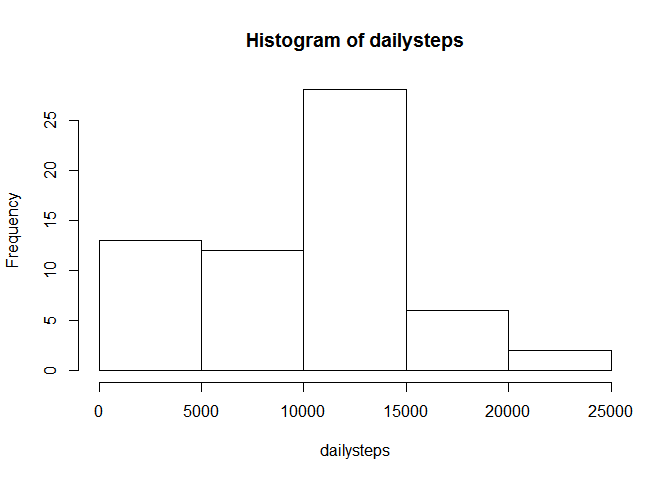
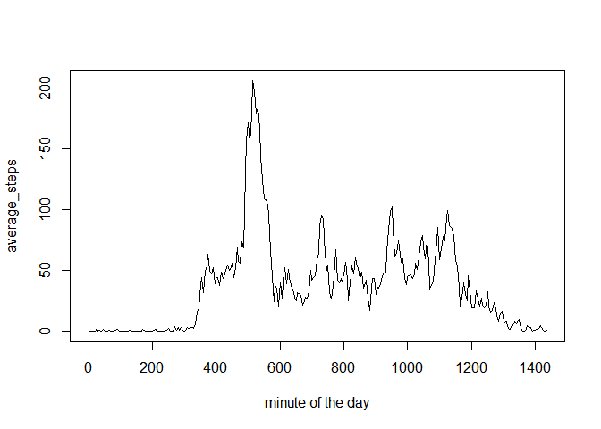
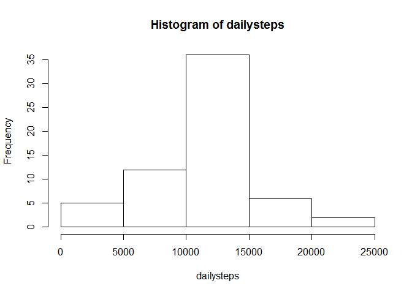
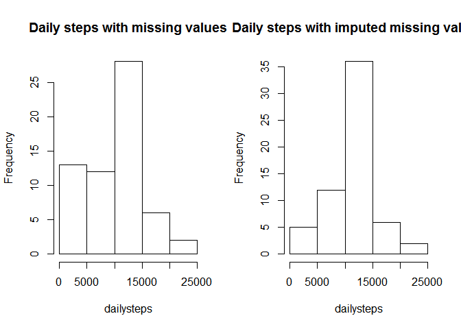
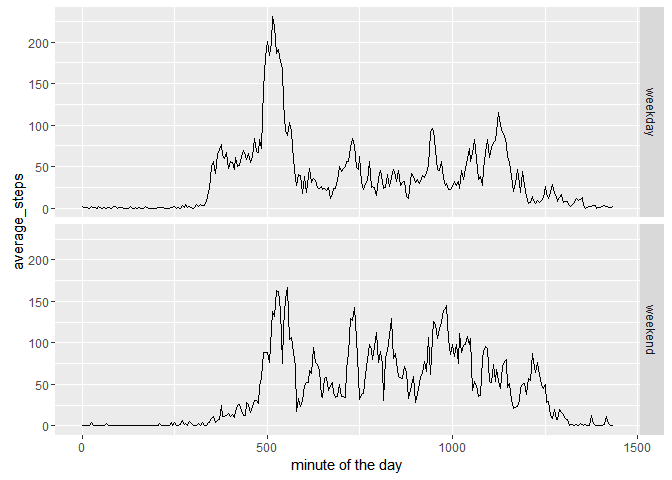

# Reproducible Research: Peer Assessment 1


## Loading and preprocessing the data


```r
library(plyr)
library(dplyr)
unzip("activity.zip")
df <- read.csv("activity.csv")
df$date <- as.Date(df$date)
df <- mutate(df, minute = as.ordered(interval))
oldlevels <- levels(df$minute)
newlevels <- gsub('([0-9][0-9])$', '\\:\\1', oldlevels)
newlevels <- gsub('^([0-9])$', '\\:0\\1', newlevels)
newlevels <- gsub('^:', '00:', newlevels)
newlevels <- gsub('^([0-9]:)', '0\\1', newlevels)
levels(df$minute) <- newlevels
```


## What is mean total number of steps taken per day?

1. Total number of steps taken by day:


```r
grdate <- group_by(df, date)
stepsbydate <- summarise(grdate, dailysteps = sum(steps, na.rm = TRUE))
stepsbydate
```

```
## Source: local data frame [61 x 2]
## 
##          date dailysteps
##        (date)      (int)
## 1  2012-10-01          0
## 2  2012-10-02        126
## 3  2012-10-03      11352
## 4  2012-10-04      12116
## 5  2012-10-05      13294
## 6  2012-10-06      15420
## 7  2012-10-07      11015
## 8  2012-10-08          0
## 9  2012-10-09      12811
## 10 2012-10-10       9900
## ..        ...        ...
```

```r
summary(stepsbydate)
```

```
##       date              dailysteps   
##  Min.   :2012-10-01   Min.   :    0  
##  1st Qu.:2012-10-16   1st Qu.: 6778  
##  Median :2012-10-31   Median :10395  
##  Mean   :2012-10-31   Mean   : 9354  
##  3rd Qu.:2012-11-15   3rd Qu.:12811  
##  Max.   :2012-11-30   Max.   :21194
```

2. Histogram of the total number of steps taken each day


```r
with(stepsbydate, hist(dailysteps))
```

 

3. The mean and median of the total number of steps taken per day


```r
meandailysteps <- mean(stepsbydate$dailysteps, na.rm = TRUE)
cat("Mean of the total number of daily steps:", meandailysteps)
```

```
## Mean of the total number of daily steps: 9354.23
```

```r
mediandailysteps <- median(stepsbydate$dailysteps, na.rm = TRUE)
cat("Median of the total number of daily steps:", mediandailysteps)
```

```
## Median of the total number of daily steps: 10395
```


## What is the average daily activity pattern?

1. Time series plot of the 5-minute interval (x-axis) and the average number of steps taken, averaged across all days (y-axis)


```r
grminute <- group_by(df, minute)
stepsbyminute <- summarise(grminute, average_steps = mean(steps, na.rm = TRUE))
with(stepsbyminute, plot((as.numeric(minute)-1)*5, average_steps, type = "l",
                         xlab = "minute of the day"))
```

 

2. Which 5-minute interval, on average across all the days in the dataset, contains the maximum number of steps?


```r
id_max <- which.max(stepsbyminute$average_steps)
maxinterval <- stepsbyminute$minute[id_max:(id_max+1)]
maxinterval <- as.character(maxinterval)
maxinterval <- gsub('^([0-9]{1})([0-9]+)$', '\\1:\\2', maxinterval)
cat("The 5-minute interval with the maximum number of steps is:", maxinterval[1],
    "to", maxinterval[2])
```

```
## The 5-minute interval with the maximum number of steps is: 08:35 to 08:40
```


## Imputing missing values

1. Calculate and report the total number of missing values in the dataset (i.e. the total number of rows with NAs)


```r
cat("Total number of missing values in the dataset:", sum(is.na(df)), "(", 
    format(mean(is.na(df))*100, digits = 2),"%)")
```

```
## Total number of missing values in the dataset: 2304 ( 3.3 %)
```

2. Devise a strategy for filling in all of the missing values in the dataset. The strategy does not need to be sophisticated. For example, you could use the mean/median for that day, or the mean for that 5-minute interval, etc.


```r
cat("The mean for the 5-minute interval will be used to fill missing values.")
```

```
## The mean for the 5-minute interval will be used to fill missing values.
```


3. Create a new dataset that is equal to the original dataset but with the missing data filled in.


```r
isna <- is.na(df$steps)
df2 <- df
df2$steps[isna] <- stepsbyminute$average_steps[as.numeric(df$minute[isna])]
sum(is.na(df2))
```

```
## [1] 0
```

4. Make a histogram of the total number of steps taken each day and Calculate and report the mean and median total number of steps taken per day. Do these values differ from the estimates from the first part of the assignment? What is the impact of imputing missing data on the estimates of the total daily number of steps?

4.1 Histogram of the total number of steps taken each day


```r
grdate2 <- group_by(df2, date)
stepsbydate2 <- summarise(grdate2, dailysteps = sum(steps))
stepsbydate2
```

```
## Source: local data frame [61 x 2]
## 
##          date dailysteps
##        (date)      (dbl)
## 1  2012-10-01   10766.19
## 2  2012-10-02     126.00
## 3  2012-10-03   11352.00
## 4  2012-10-04   12116.00
## 5  2012-10-05   13294.00
## 6  2012-10-06   15420.00
## 7  2012-10-07   11015.00
## 8  2012-10-08   10766.19
## 9  2012-10-09   12811.00
## 10 2012-10-10    9900.00
## ..        ...        ...
```

```r
summary(stepsbydate2)
```

```
##       date              dailysteps   
##  Min.   :2012-10-01   Min.   :   41  
##  1st Qu.:2012-10-16   1st Qu.: 9819  
##  Median :2012-10-31   Median :10766  
##  Mean   :2012-10-31   Mean   :10766  
##  3rd Qu.:2012-11-15   3rd Qu.:12811  
##  Max.   :2012-11-30   Max.   :21194
```

```r
with(stepsbydate2, hist(dailysteps))
```

 

4.2. The mean and median of the total number of steps taken per day


```r
meandailysteps2 <- mean(stepsbydate2$dailysteps)
cat("Mean of the total number of daily steps:", meandailysteps2)
```

```
## Mean of the total number of daily steps: 10766.19
```

```r
mediandailysteps2 <- median(stepsbydate2$dailysteps)
cat("Median of the total number of daily steps:", mediandailysteps2)
```

```
## Median of the total number of daily steps: 10766.19
```

4.3 Do these values differ from the estimates from the first part of the assignment? 


```r
cat("Yes, they differ from the estimated values with missing values.")
```

```
## Yes, they differ from the estimated values with missing values.
```


4.4 What is the impact of imputing missing data on the estimates of the total daily number of steps?


```r
par(mfrow = c(1,2))
with(stepsbydate, hist(dailysteps, main = "Daily steps with missing values"))
with(stepsbydate2, hist(dailysteps, main = "Daily steps with imputed missing values"))
```

 

```r
par(mfrow = c(1,1))

cat("It can be noticed a change in the histogram distribution. With imputed missing
    values the distribution is more symetric and the mean and mediam are equal.")
```

```
## It can be noticed a change in the histogram distribution. With imputed missing
##     values the distribution is more symetric and the mean and mediam are equal.
```

## Are there differences in activity patterns between weekdays and weekends?

1. Create a new factor variable in the dataset with two levels – “weekday” and “weekend” indicating whether a given date is a weekday or weekend day.


```r
week_period <- function(x) { ifelse(weekdays(x) %in% c("sábado", "domingo"), "weekend", "weekday")}
df3 <- mutate(df2, weekperiod = as.factor(week_period(df2$date)))
```


2. Make a panel plot containing a time series plot (i.e. type = "l") of the 5-minute interval (x-axis) and the average number of steps taken, averaged across all weekday days or weekend days (y-axis). See the README file in the GitHub repository to see an example of what this plot should look like using simulated data.


```r
grminuteperiod <- group_by(df3, minute, weekperiod)
stepsbyminutebyperiod <- summarise(grminuteperiod, average_steps = mean(steps))

library(ggplot2)
```

```
## Warning: package 'ggplot2' was built under R version 3.2.3
```

```r
qplot((as.numeric(minute)-1)*5, average_steps, data = stepsbyminutebyperiod,
      facets = weekperiod ~ . , geom = "line", xlab = "minute of the day")
```

 

```r
cat("Yes, it can be noticed a clear difference between patters in weekdays and weekends. In weekends, the activity start later and the maximum number of steps is also less than in weekdays.")
```

```
## Yes, it can be noticed a clear difference between patters in weekdays and weekends. In weekends, the activity start later and the maximum number of steps is also less than in weekdays.
```

